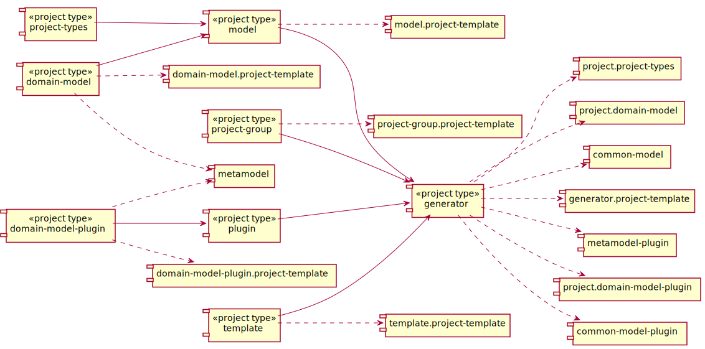

<!-- @head-content@ -->
# laplacian/project-group.project-template

这个模板是项目组用来生成标准的项目文件夹结构和操作和开发脚本的模板。


*Read this in other languages*: [[English](README.md)] [[日本語](README_ja.md)]
<!-- @head-content@ -->

<!-- @toc@ -->
## Table of contents
- [概述](#概述)

  * [项目依赖性](#项目依赖性)

- [如何使用](#如何使用)

- [索引](#索引)

  * [命令列表](#命令列表)

  * [源码列表](#源码列表)


<!-- @toc@ -->

<!-- @main-content@ -->
## 概述


### 项目依赖性


下图是每个项目之间的依赖关系。


## 如何使用

要应用此template模块，请在项目定义中加入以下条目

```yaml
project:
  templates:
  - group: laplacian
    name: project-group.project-template
    version: 1.0.0
```

您可以运行以下命令查看受本模块应用影响的资源列表及其内容

```console
$ ./script/generate --dry-run

diff --color -r PROJECT_HOME/.NEXT/somewhere/something.md PROJECT_HOME/somewhere/something.md
1,26c1,10
< content: OLD CONTENT
---
> content: NEW CONTENT
```

如果没有问题，请执行下面的命令来反映变化

```console
$ ./script/generate

```


## 索引


### 命令列表


- [./script/generate.sh](<./scripts/generate.sh>)

  生成本项目中每个`src/` `model/` `template/`目录下的资源。
  结果反映在`dest/` `doc/` `script/`的每个目录中。

  *生成器输入文件*

  - `src/`
    存储未被生成器处理的静态资源。
    这个目录的内容直接复制到`dest/`目录中。

  - `model/`
    存储以 *YAML* 或 *JSON* 格式编写的静态模型数据文件，用于生成。

  - `template/`
    这个目录中包含了用于生成的模板文件。
    扩展名为`.hbs`的文件将作为模板处理。所有其他文件都会被复制。

    - `template/dest` `template/doc` `template/scripts`
      这些目录中的每一个目录都包含要输出的资源的模板文件，其目录为 `dest/`doc/`scripts`。

    - `template/model` `template/template`
      这些目录存储模板文件，更新生成过程中使用的`template/`和`model/`的内容。
      如果在生成过程中更新了 `template/` `model/` 的内容，则生成过程将递归执行。
      在上述过程中发生的对 `template/` `model/` 的变化被视为中间状态，并在过程完成后丢失。
      使用 *--dry-run* 选项来检查这些中间文件。

  *生成器输出文件*

  - `dest/`
    输出作为生成过程的结果的应用程序和模块的源文件。

  - `doc/`
    输出项目文件。

  - `scripts/`
    输出开发和操作中使用的各种脚本。

  > Usage: generate.sh [OPTION]...
  >
  > -h, --help
  >
  >   显示如何使用此命令。
  >   
  > -v, --verbose
  >
  >   显示更详细的命令执行信息。
  >   
  > -d, --dry-run
  >
  >   该命令处理完毕后，生成的文件将被输出到`.NEXT`目录下。
  >   不反映到`dest/`doc/`doc/`scripts/`文件夹中。
  >   此外，`.NEXT`目录的内容与当前文件之间的差异。
  >   这个目录还包含了在生成过程中创建的任何中间文件。
  >   
  > -r, --max-recursion [VALUE]
  >
  >   当`model/` `template/`目录的内容在生成过程中被更新时，递归执行的次数上限。
  >    (Default: 10)
  > , --local-module-repository [VALUE]
  >
  >   存储本地构建的模块的存储库路径。
  >   这个存储库中的模块具有最高优先级。
  >   
  > , --updates-scripts-only
  >
  >   仅更新脚本文件。
  >   这个选项在项目初始生成时用于生成生成器脚本本身。
  >   
- [./script/publish-local.sh](<./scripts/publish-local.sh>)

  项目中的资源生成后，在`./dest`目录下的资源作为模板模块建立，并在本地资源库中注册。

  > Usage: publish-local.sh [OPTION]...
  >
  > -h, --help
  >
  >   显示如何使用此命令。
  >   
  > -v, --verbose
  >
  >   显示更详细的命令执行信息。
  >   
  > -r, --max-recursion [VALUE]
  >
  >   这个选项与[generate.sh](<./scripts/generate.sh>)中的同名选项相同。
  >    (Default: 10)
  > , --skip-generation
  >
  >   这个选项与[generate.sh](<./scripts/generate.sh>)中的同名选项相同。
  >   
  > , --local-module-repository [VALUE]
  >
  >   到本地存储库的路径。
  >   如果在指定的路径中不存在存储库，将自动创建。
  >   
### 源码列表


- [model/project.yaml](<./model/project.yaml>)
- [src/template/doc/image/project-dependency-graph.puml.hbs](<./src/template/doc/image/project-dependency-graph.puml.hbs>)
- [src/template/model/project/document/sections/index/{if project.subprojects}/project-list.hbs.yaml](<./src/template/model/project/document/sections/index/{if project.subprojects}/project-list.hbs.yaml>)
- [src/template/model/project/document/sections/overview/project-dependency-graph.hbs.yaml](<./src/template/model/project/document/sections/overview/project-dependency-graph.hbs.yaml>)
- [src/template/model/project/scripts/{if (eq project.type 'project-group')}/{each project_types as project_type}/create-new-{hyphen project_type.name}-project.hbs.yaml](<./src/template/model/project/scripts/{if (eq project.type 'project-group')}/{each project_types as project_type}/create-new-{hyphen project_type.name}-project.hbs.yaml>)
- [src/template/scripts/{if (eq project.type 'project-group')}/{each project_types as project_type}/create-new-{hyphen project_type.name}-project@main@.hbs.sh](<./src/template/scripts/{if (eq project.type 'project-group')}/{each project_types as project_type}/create-new-{hyphen project_type.name}-project@main@.hbs.sh>)
- [src/template/scripts/install.hbs.sh](<./src/template/scripts/install.hbs.sh>)


<!-- @main-content@ -->